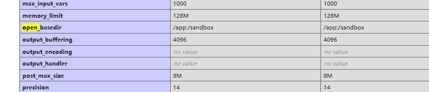

## [RoarCTF 2019]Easy Java

### 0x00 基础

WEB-INF是Java的WEB应用的安全目录。所谓安全就是客户端无法访问，只有服务端可以访问的目录。
如果想在页面中直接访问其中的文件，必须通过web.xml文件对要访问的文件进行相应映射才能访问。
/WEB-INF/web.xml : Web应用程序配置文件，描述了 servlet 和其他的应用组件配置及命名规则。

<!--more-->

/WEB-INF/classes/ : 包含了站点所有用的 class 文件，包括 servlet class 和非servlet class，他们不能包含在 .jar文件中。
/WEB-INF/lib/ : 存放web应用需要的各种JAR文件，放置仅在这个应用中要求使用的jar文件,如数据库驱动jar文件。
页面放在WEB-INF目录下面,这样可以限制访问,提高安全性.如JSP,html

在get方式拿不到文件的时候试试post

### 0x01 分析&操作

下载web.xml文件查看

```xml
<?xml version="1.0" encoding="UTF-8"?>
<web-app xmlns="http://xmlns.jcp.org/xml/ns/javaee"
         xmlns:xsi="http://www.w3.org/2001/XMLSchema-instance"
         xsi:schemaLocation="http://xmlns.jcp.org/xml/ns/javaee http://xmlns.jcp.org/xml/ns/javaee/web-app_4_0.xsd"
         version="4.0">

    <welcome-file-list>
        <welcome-file>Index</welcome-file>
    </welcome-file-list>

    <servlet>
        <servlet-name>IndexController</servlet-name>
        <servlet-class>com.wm.ctf.IndexController</servlet-class>
    </servlet>
    <servlet-mapping>
        <servlet-name>IndexController</servlet-name>
        <url-pattern>/Index</url-pattern>
    </servlet-mapping>

    <servlet>
        <servlet-name>LoginController</servlet-name>
        <servlet-class>com.wm.ctf.LoginController</servlet-class>
    </servlet>
    <servlet-mapping>
        <servlet-name>LoginController</servlet-name>
        <url-pattern>/Login</url-pattern>
    </servlet-mapping>

    <servlet>
        <servlet-name>DownloadController</servlet-name>
        <servlet-class>com.wm.ctf.DownloadController</servlet-class>
    </servlet>
    <servlet-mapping>
        <servlet-name>DownloadController</servlet-name>
        <url-pattern>/Download</url-pattern>
    </servlet-mapping>

    <servlet>
        <servlet-name>FlagController</servlet-name>
        <servlet-class>com.wm.ctf.FlagController</servlet-class>
    </servlet>
    <servlet-mapping>
        <servlet-name>FlagController</servlet-name>
        <url-pattern>/Flag</url-pattern>
    </servlet-mapping>

</web-app>
```

其中有一个FlagController，尝试下载这个文件

下载后直接打开，发现有一串base64编码，解码后就是flag



`flag{cb0751c7-6081-482d-8b03-f0edede8e178}`