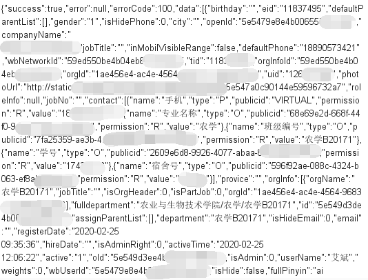
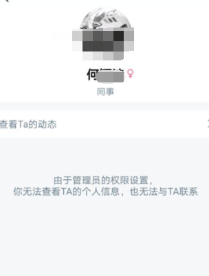

# 0x00 起因

今天学校开始使用云之家app上报健康数据，云之家有一个同事圈，类似于微信的朋友圈，不过是实名的！！！点击头像就可以知道手机号码、宿舍号码、班级。然后就有一大群校友在发qq空间说


<!--more-->


我也去试了一下发现还真的是。

# 0x01 经过

不过呢，好景不长，过了一会就被管理员设置权限了，只能看见本班同学的信息，或者是在同事圈里发了信息的校友姓名。

好在管理员设置的时候笔者抓了一下包

通过通讯录查询校友和老师的接口是

`/openaccess/contacts/getPartHidePersonInfo`

需要post数据（被查询者的）ids和token，返回json



```
{"success":true,"error":null,"errorCode":100,"data":[{"eid":"118****","gender":"1","openId":"5e5479e8e4b00655********","jobTitle":"同事","permission":1,"oId":"5e549d3ee4b00655bff9f****","tid":"1183****","orgInfoId":"59ed550be4b04eb8c4*****","wbUserId":"5e5479e8e4b00655bff1****","uid":"126227448","photoUrl":"http://static.****.com/****/load?id=5e547a0c90144e595967****","name":"艾**","id":"5e549d3de4b00655bff9****","status":3}]}
```



上面是还没有设置权限的结果，下面是设置权限后的结果,设置前没有截图，所以就没有图了。

什么都没有了，只有ID什么什么的

开启抓包模式后一路乱点。

发现了一个接口

`/openaccess/user/getPersonsByOids `

需要post的数据是（被查询者的）oids和token

返回的数据里面除了宿舍号码，其他都有

问题的需要知道别人的oid，通讯录被设置权限以后搜索不到了

经过测试以后可以使用同事圈的搜索


抓包发现接口是同事圈域名的`/thirdapp/tribe/searchContacts?offset=0&criteria=中文的url编码`接口get型，返回的数据直接包含电话号码


还发现了一个GET类型接口同事圈域名的`/thirdapp/tribe/getUserOpenId?userId=`也能获取数据，不过没有学号。

# 0x02 结束

以后想要通过姓名查询学号，手机号码有地方了嘿嘿。比如说想追的妹子。hhhhh